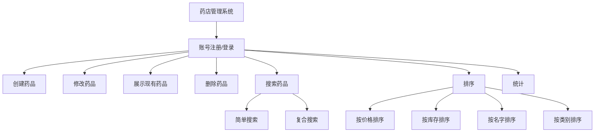
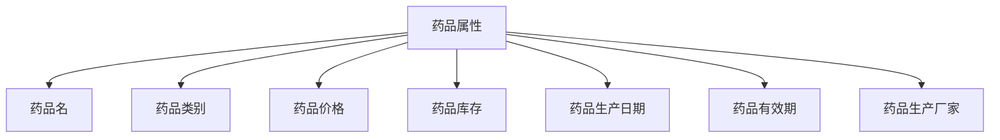
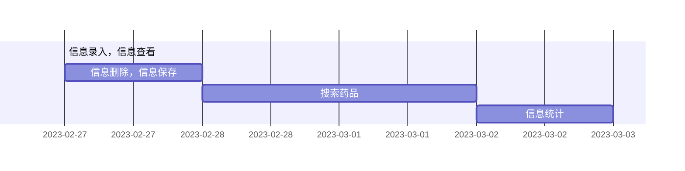

# 药店管理系统
## 功能简介

```mermaid
flowchart TB
药店管理系统-->账号注册/登录
账号注册/登录-->创建药品
账号注册/登录-->修改药品
账号注册/登录-->展示现有药品
账号注册/登录-->删除药品
账号注册/登录-->搜索药品
搜索药品-->简单搜索
搜索药品-->复合搜索
账号注册/登录-->排序
排序-->按价格排序
排序-->按库存排序
排序-->按名字排序
排序-->按类别排序
账号注册/登录-->统计
```
## 药品属性

```mermaid
flowchart TB
药品属性-->药品名
药品属性-->药品类别
药品属性-->药品价格
药品属性-->药品库存
药品属性-->药品生产日期
药品属性-->药品有效期
药品属性-->药品生产厂家
```

   
## 时间计划

```mermaid
gantt
    信息录入，信息查看 :des1, 2023-02-27,2023-02-28
    信息删除，信息保存 :des2, after des1, 1d
    搜索药品 :des3, after des2, 2d
    信息统计 :des4, after des3, 1d
```